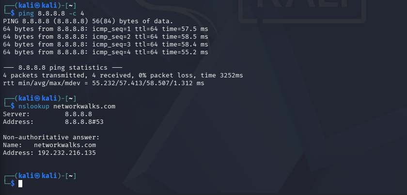
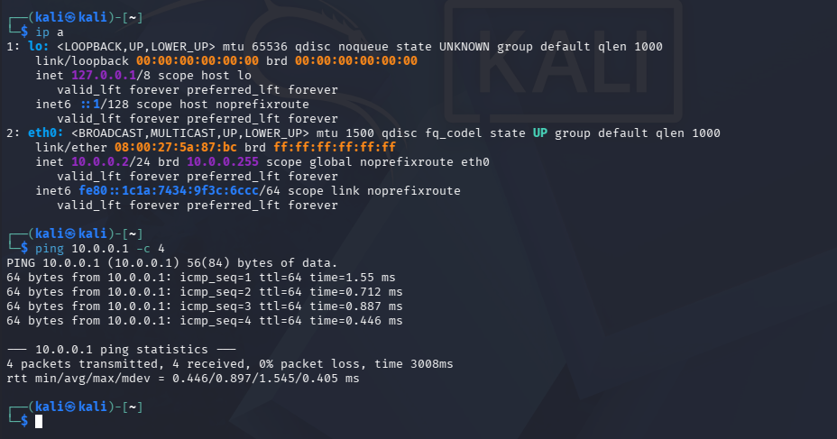

# NETWORKWALKS-B083C-WK1-PM1-CYBERSECURITY-LAB-SETUP

# 🔐 Cybersecurity Lab Environment Setup

**Building an isolated virtual lab for penetration testing and ethical hacking practice**


---

## 📌 Project Overview

This project focuses on setting up a **virtual cybersecurity and penetration-testing laboratory** using VirtualBox and Kali Linux.

The purpose of the lab is to create a controlled environment where cybersecurity tools, network scanning, reconnaissance, vulnerability assessment, and other security-testing activities can be performed safely and repeatedly.

The lab is configured on a private virtual network so that additional machines can be added later and used as targets for authorized security testing.

---

## 🎯 Objectives

- Install and configure VirtualBox.
- Import Kali Linux as a virtual machine.
- Create a private **NAT Network** for the cybersecurity lab.
- Configure network connectivity for Kali Linux.
- Assign a consistent static IP address to the Kali VM.
- Verify network connectivity and DNS resolution.
- Take a clean VM snapshot for recovery.
- Document the complete setup process, including issues encountered.

---

## 🛡️ Purpose of the Lab

The lab provides an isolated and controlled environment for cybersecurity learning and authorized security testing. It can be used for:

- Network reconnaissance
- Port scanning
- Vulnerability assessment
- Packet analysis
- Security-tool experimentation

⚠️ **Important:** This laboratory must only be used for systems that you own or have explicit permission to test.

---

## ⚙️ Lab Configuration

| 🧩 Component       | ⚙️ Configuration   |
| ------------------ | ------------------ |
| 🖥️ Host OS         | Windows            |
| 🧰 Hypervisor       | VirtualBox 7.2     |
| 🐉 Security OS      | Kali Linux 2026.2  |
| 🌐 Virtual Network  | NAT Network        |
| 📡 Network Address  | 10.0.0.0/24        |
| 🐧 Kali IP Address  | 10.0.0.2/24        |
| 🚪 Default Gateway  | 10.0.0.1           |
| 🌍 DNS Server       | 8.8.8.8            |

---

# 🪜 Lab Setup Procedure

## Step 1. Create the NAT Network

A dedicated NAT Network was created in VirtualBox via the Network Manager.

Configuration:

Network Name: NatNetwork
IPv4 Prefix: 10.0.0.0/24
DHCP: Enabled


A **NAT Network** was chosen (instead of simple NAT) because it allows multiple VMs on the same network to communicate with each other while still having outbound internet access.

## Step 2. Import Kali Linux

The official Kali Linux VirtualBox image was downloaded and imported. Default credentials for the prebuilt image:

Username: kali
Password: kali


The network adapter was set to:

Attached to: NAT Network
Name: NatNetwork


## Step 3. Configure the Kali Linux Static IP

The VM's network connection was edited to use a manual/static IPv4 configuration:

IP Address: 10.0.0.2
Subnet Mask: 255.255.255.0 (/24)
Gateway: 10.0.0.1
DNS: 8.8.8.8


Command used (via nmcli):
```bash
sudo nmcli connection modify "Wired connection 1" ipv4.addresses 10.0.0.2/24 ipv4.gateway 10.0.0.1 ipv4.dns 8.8.8.8 ipv4.method manual
sudo nmcli connection down "Wired connection 1"
sudo nmcli connection up "Wired connection 1"
```


## Step 4. Take a Clean Snapshot

Once connectivity was confirmed, a snapshot was taken as a clean baseline:

Snapshot name: Clean Kali - Network Setup


This allows the VM to be restored to this working state if future exercises break the configuration.

---

# 🔎 Lab Verification

| ✅ Test                       | 🧾 Command                       | 🎯 Result               |
| ----------------------------- | --------------------------------- | ------------------------ |
| 🌐 Check IP address            | `ip a`                             | `10.0.0.2/24` on `eth0` ✅ |
| 📡 Test gateway                | `ping 10.0.0.1 -c 4`               | 4/4 received, 0% loss ✅ |
| 🌍 Test Internet connectivity  | `ping 8.8.8.8 -c 4`                | 4/4 received, 0% loss ✅ |
| 🔎 Test DNS resolution         | `nslookup networkwalks.com`        | Resolved successfully ✅ |




---

# 🐞 Problems Encountered & Solutions

## Problem 1: "IP configuration could not be reserved" (DAD timeout)

After configuring the static IP, activating the connection failed with:

Error: Connection activation failed: IP configuration could not be reserved (no available address, timeout, etc.)


This is a known issue on VirtualBox 7 + recent Kali Linux versions, related to Duplicate Address Detection (DAD) timing out.

**Fix:**
```bash
sudo nmcli connection modify "Wired connection 1" ipv4.dad-timeout 0
sudo nmcli connection down "Wired connection 1"
sudo nmcli connection up "Wired connection 1"
```

After applying this, the connection activated successfully and full connectivity (gateway, internet, DNS) was confirmed.

## Problem 2: Network settings greyed out / not editable

The VM's Settings → Network tab was locked and not editable, even though the VM appeared "off".

**Cause:** the VM was in a **Saved State**, not fully powered off.

**Fix:** Right-click the VM → **Discard Saved State**, then reopen Settings — fields become editable again. (Note: this does not delete any files or data on the VM's disk.)

---

# 💡 What I Learned

- **NAT vs NAT Network**: a NAT Network allows multiple VMs on the same virtual network to talk to each other while also providing outbound internet access — essential for building a multi-machine lab.
- **VM state matters**: a VM in "Saved State" behaves differently from "Powered Off" and can lock settings from being changed.
- **Static IP configuration** in Kali via `nmcli`, including handling the DAD-timeout bug specific to recent VirtualBox/Kali versions.
- **Snapshots** provide a safe rollback point before risky configuration changes.
- **Documentation matters**: recording exact commands, errors, and fixes makes the setup reproducible and useful for future reference.

---

# 🔐 Security & Ethical Use

This laboratory is intended strictly for education and authorized testing purposes only.

---

# 🔗 Tools & Resources

- **VirtualBox:** <https://virtualbox.org/wiki/Downloads>
- **Kali Linux:** <https://kali.org/get-kali>

---

# 👤 Author

**Khadija**
Génie Réseaux et Télécommunications — EMI
Networkwalks Cybersecurity — Batch B083C

---

## 📌 Project Information

**Program Name:** Cybersecurity at Networkwalks | **Batch:** B083C | **Week:** 01 | **Project:** Cybersecurity & Pentesting Lab Setup
