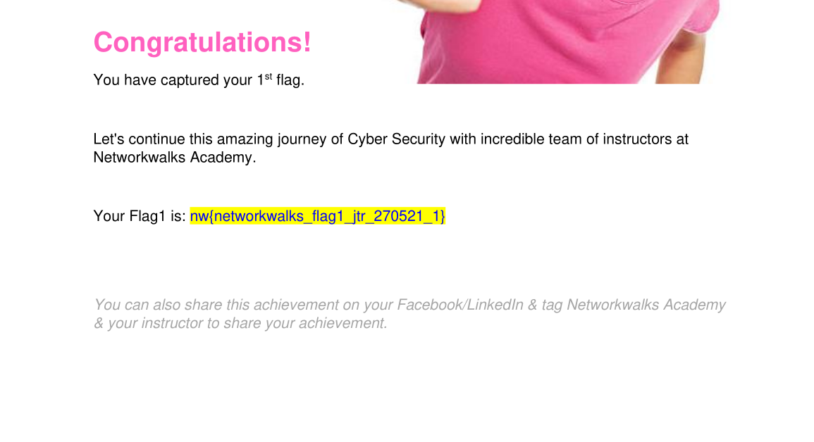
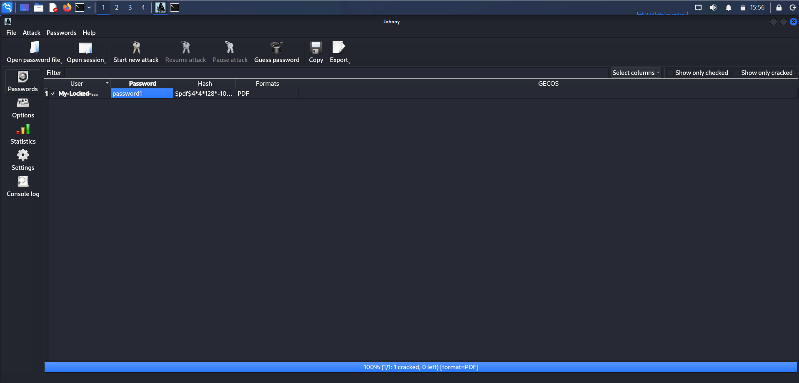
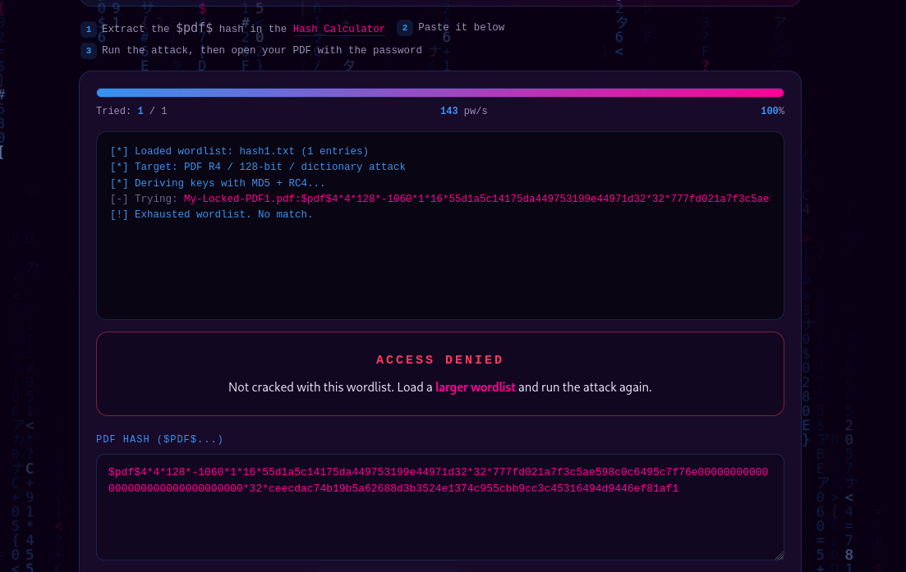

Week3 · MD
Week 3 — Password Cracking (NetworkWalks Cybersecurity & Ethical Hacking Internship, Batch 83)
Objective

Understand how password-protected files are cracked in practice by recovering the password of an encrypted PDF (My-Locked-PDF1.pdf) using two different approaches:

W3-PM1 — John the Ripper (JTR) + Johnny GUI
W3-PM2 — NetworkWalks' own browser-based Hash Calculator + Password Cracker

Both modules target the same file and rely on the same underlying concept — a dictionary attack — but differ in tooling and execution environment.

Background: how it works

A password-protected PDF does not store the password in plain text. Instead, it stores a hash — a scrambled, one-way fingerprint derived from the password plus the PDF's encryption metadata (revision number, key length, etc.). To recover the password:

Extract the hash from the PDF's internal structure.
Run a dictionary attack — hash each candidate password from a wordlist using the same algorithm, and compare it against the extracted hash. A match reveals the real password.
Environment
Kali Linux VM (VMware), part of the existing internship lab setup
John the Ripper — pre-installed on Kali
Johnny GUI — installed via sudo apt install johnny
NetworkWalks Hash Calculator / Password Cracker — browser-based, no install required
W3-PM1 — Password Cracking with JTR
Steps
Downloaded My-Locked-PDF1.pdf to the Kali VM.
Extracted the crackable hash using pdf2john, bundled with John the Ripper:
bash
   pdf2john "My-Locked-PDF1.pdf" > hash1.txt
Ran John the Ripper against the extracted hash:
bash
   john hash1.txt
   john --show hash1.txt
Installed Johnny (JTR's GUI) to confirm the same result visually:
bash
   sudo apt install johnny
Opened Johnny, pointed it at /usr/bin/john, loaded hash1.txt via Open password file, and clicked Start new attack.
Result: 100% (1/1 cracked, 0 left) — password recovered and confirmed by opening the PDF.
Screenshot

(insert Johnny result screenshot here — password column showing the cracked value)

W3-PM2 — Password Cracking with NetworkWalks Tools
Steps
Opened the NetworkWalks Hash Calculator and uploaded My-Locked-PDF1.pdf.
The tool parsed the PDF's encryption metadata locally in-browser (no file upload to a server) and generated a $pdf$... hash — the browser-side equivalent of pdf2john.
Copied the hash and pasted it into the NetworkWalks Password Cracker.
Ran a dictionary attack against the built-in 100-word list.
The tool matched the hash and displayed the cracked password, confirming the result from W3-PM1.
Comparison
	Hash extraction	Cracking	Wordlist
W3-PM1 (JTR)	pdf2john on Kali filesystem	john / Johnny GUI, local CPU	John's default wordlist
W3-PM2 (NW tools)	JavaScript, in-browser	JavaScript, in-browser	100-word built-in list

Both approaches implement identical cryptographic logic. JTR is the professional-grade, offline, scriptable option used in real engagements; the NetworkWalks tools are a zero-setup way to visualize the same process for learning purposes.
### Results

*PDF1 — the password-protected file used as the target for both cracking methods.*

*pdf2 — hash extracted from the PDF, ready to be fed into the cracking tool.*

*johnny — John the Ripper cracked the password via the Johnny GUI, shown as 100% (1/1 cracked).*

*networkwalkstool — same password confirmed using NetworkWalks' browser-based Hash Calculator and Password Cracker.*
Key Takeaways
Password protection on files like PDFs relies on hashing, not encryption of the password itself — the password is never stored, only verifiable.
Weak, short, or common passwords are trivially recoverable via dictionary attacks regardless of which tool is used.
Command-line tools (John) and GUI tools (Johnny) are functionally equivalent — the GUI is a usability layer over the same cracking engine.
This reinforces the importance of strong, unique passwords for sensitive files and systems.
Conclusion

Both essential Week 3 modules were completed successfully, recovering the same password via two independent methods and confirming the result by opening the target PDF in each case.
